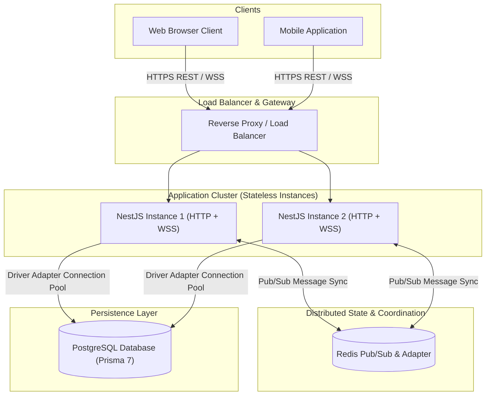
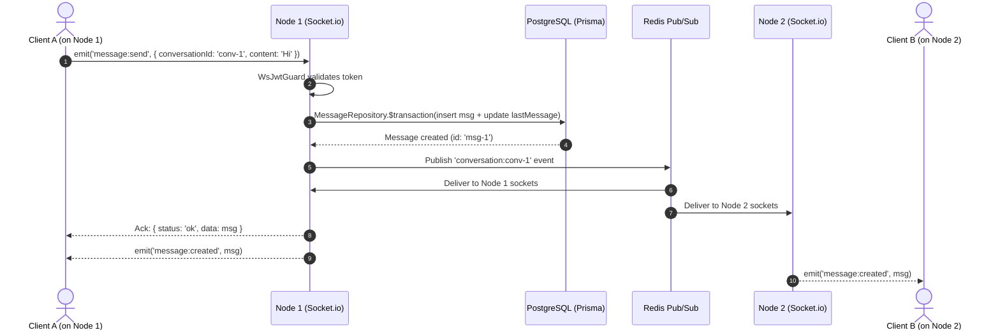
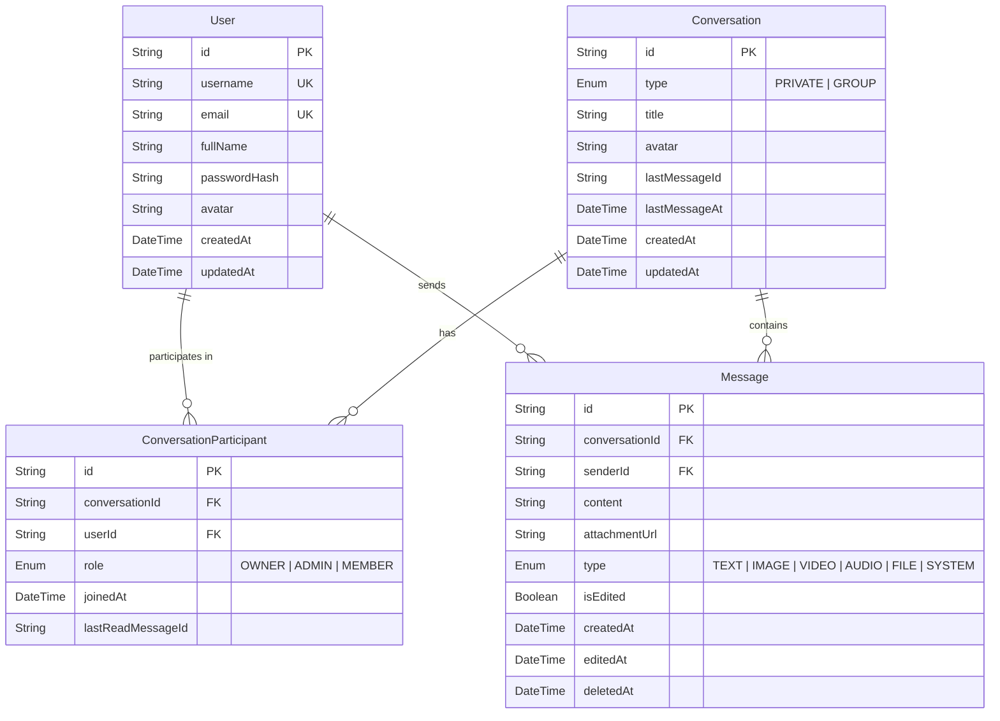

# High-Level & System Architecture

This document details the architectural design of the **Real-Time Distributed Chat Platform**.

---

## 1. High-Level Architecture Overview

The system is designed around a multi-tier, modular monolith capable of horizontal scaling across both HTTP API consumers and real-time WebSocket connections via Redis Pub/Sub.



---

## 2. Layer Responsibilities & Data Flow

The backend adheres strictly to the **Separation of Concerns** principle:

```
[ HTTP Request / WS Frame ]
            |
            v
[ Controller / Gateway ]   <--- Extracts payload, parses params, handles HTTP/WS status
            |
            v
[ Validation Pipe / Guard ] <--- Validates DTOs (class-validator), verifies JWT auth
            |
            v
[ Application Service ]    <--- Business logic, permissions, domain validation, transactions
            |
            v
[ Repository Layer ]       <--- Abstract data access layer
            |
            v
[ Prisma ORM v7 ]          <--- SQL generator, type safety, driver adapter
            |
            v
[ PostgreSQL ]             <--- Relational storage, ACID guarantees, indexes
```

### Layer Rules:
1. **Controllers & Gateways**:
   - MUST NOT contain business rules or direct database calls.
   - Responsible for extracting authenticated user tokens (`@CurrentUser()`), route parameters, and HTTP response codes.
2. **Services (`AuthService`, `ConversationService`, `MessageService`, `PresenceService`)**:
   - Contains all domain invariants (e.g. self-chat prevention, 1-on-1 idempotency, message editing authorization).
   - Coordinates transactional writes and multi-repository actions.
3. **Repositories (`UserRepository`, `ConversationRepository`, `MessageRepository`)**:
   - Encapsulates raw Prisma queries, query shapes, includes, sorting, and pagination logic.
   - Provides a testable contract allowing database mocking without starting live PostgreSQL instances during unit tests.

---

## 3. Real-Time Distributed Architecture

### Multi-Instance Real-Time Synchronization

In a scaled environment with multiple WebSocket server processes:
- **Client A** is connected to **WebSocket Server 1**.
- **Client B** is connected to **WebSocket Server 2**.
- Both users belong to `conversation:conv-1`.



---

## 4. Presence Architecture

A user can have multiple concurrent connections (e.g. two browser tabs, desktop client, phone).

- The `PresenceService` maintains in-memory maps:
  - `userSockets: Map<string, Set<string>>` (maps `userId` to active `socketId` set)
  - `socketToUser: Map<string, string>` (maps `socketId` to `userId`)
  - `lastSeenMap: Map<string, Date>`
- **Offline $\to$ Online transition**: Only triggers when the user's active socket count changes from $0 \to 1$.
- **Online $\to$ Offline transition**: Only triggers when the user's active socket count reaches $0$.

---

## 5. Database Architecture & Indexing Strategy



### Critical Indexes & Rationale:
1. `ConversationParticipant.@@unique([conversationId, userId])`:
   - Prevents duplicate participant rows.
   - Enforces relational integrity at the storage engine level.
2. `Message.@@index([conversationId, createdAt])`:
   - Accelerates cursor-based message pagination queries (`WHERE conversationId = ? ORDER BY createdAt ASC`).
3. `Message.@@index([conversationId, deletedAt])`:
   - Accelerates soft-deletion filters avoiding table scans on deleted items.
4. `Conversation.@@index([lastMessageAt])`:
   - Accelerates conversation list inbox queries sorted by recent activity.
