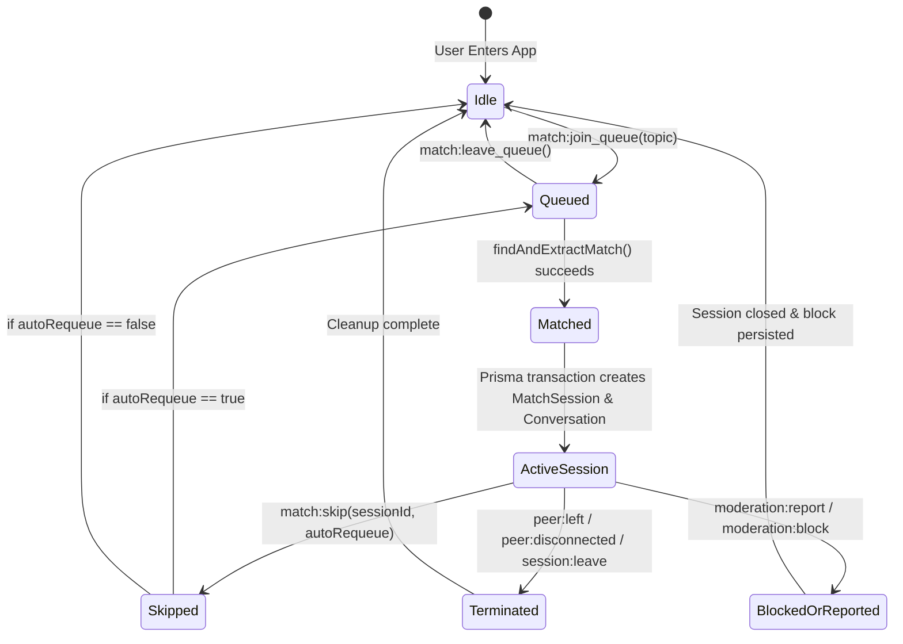

# NexusPulse Matchmaking Architecture & Concurrency Engine

## 1. Executive Summary

NexusPulse transforms spontaneous real-time social chat by delivering an atomic, low-latency matchmaking engine. Rather than relying on heavyweight database polling or complex distributed coordinator locks for ephemeral queues, NexusPulse utilizes an **in-memory thread-safe FIFO Queue (`MatchQueue`)** coupled with a high-throughput **WebSocket Event Gateway (`ChatGateway`)** and transactional **PostgreSQL session persistence (`MatchService`)**.

---

## 2. Core Matchmaking Principles

| Principle | Engineering Implementation | Why It Matters |
| :--- | :--- | :--- |
| **Atomic Extraction** | Mutex/Critical section `findAndExtractMatch` | Guarantees zero duplicate pairings or ghost tickets under high concurrency. |
| **Mutual Exclusion** | Dynamic Blocklist Filtering via `Block` model | Users who blocked each other are never paired, verified before pairing. |
| **Topic Affinity** | Segmented ticket queues (`topic` tags) | Allows users to choose between casual chats, `#tech`, `#languages`, etc. |
| **Fail-Safe Cleanup** | Heartbeat and socket disconnect hooks | Disconnected users are evicted immediately from the queue without orphaned states. |
| **Sub-Millisecond Pairing** | Memory-resident pointers | Matching latency is bounded within $<1\text{ms}$ under typical loads. |

---

## 3. Matchmaking Lifecycle State Machine



---

## 4. Concurrency & Mutex Mechanics

### Atomic Extraction (`findAndExtractMatch`)
When user $B$ enters the matchmaking queue for topic $T$, `MatchService` executes:

```typescript
const match = this.matchQueue.findAndExtractMatch(
  userId,
  topic,
  (candidateUserId) => !blockedUserIds.has(candidateUserId)
);
```

1. **Self-Exclusion**: A user can never be matched with themselves, even if multiple browser tabs or devices are open.
2. **Atomic Splice**: The matching candidate is atomically spliced from the queue array in the same tick of the Node.js event loop before any other event can reference that ticket.
3. **Double-Commit Prevention**: If two sockets emit `match:join_queue` simultaneously, the first extraction wins and removes the ticket, ensuring the second ticket either matches with the next available candidate or waits in the queue.

---

## 5. WebSocket Event Contract

### Client to Server
- `match:join_queue`: Payload `{ topic?: string }`
  - Enters the user into the queue.
  - Acknowledges with `{ status: 'queued', position: number, topic: string }`.
- `match:leave_queue`:
  - Evicts user ticket from queue.
- `match:skip`: Payload `{ sessionId: string, autoRequeue?: boolean, topic?: string }`
  - Immediately ends active session, notifies partner via `peer:skipped`, and conditionally requeues.
- `session:leave`: Payload `{ sessionId: string }`
  - Ends session without re-queueing.

### Server to Client
- `match:found`: Payload:
  ```json
  {
    "sessionId": "clz...",
    "conversationId": "clz...",
    "topic": "tech",
    "startedAt": "2026-09-06T14:30:00.000Z",
    "peer": {
      "id": "usr_456",
      "username": "bob",
      "fullName": "Bob Engineer",
      "avatar": "https://..."
    }
  }
  ```
- `peer:skipped`: Dispatched to the remaining partner when their peer skips.
- `peer:left`: Dispatched when the partner deliberately leaves the session.
- `peer:disconnected`: Dispatched when the partner's WebSocket connection drops.
- `peer:ended`: Dispatched when the session is closed by system or moderation.

---

## 6. Disconnect & Failure Recovery

In spontaneous chat systems, unexpected client disconnects are common (browser closed, mobile network loss, tab navigation). NexusPulse handles this via dual-layer detection:

1. **`PresenceService.handleDisconnect`**:
   Tracks remaining socket count for the user. When all sockets for `userId` drop, `isOffline` becomes true.
2. **`MatchService.handleUserDisconnect`**:
   - Removes any active queue tickets for `userId`.
   - Locates any `ACTIVE` sessions involving `userId`.
   - Updates session status to `DISCONNECTED` in PostgreSQL.
   - Emits `peer:disconnected` to the other participant's active sockets.
