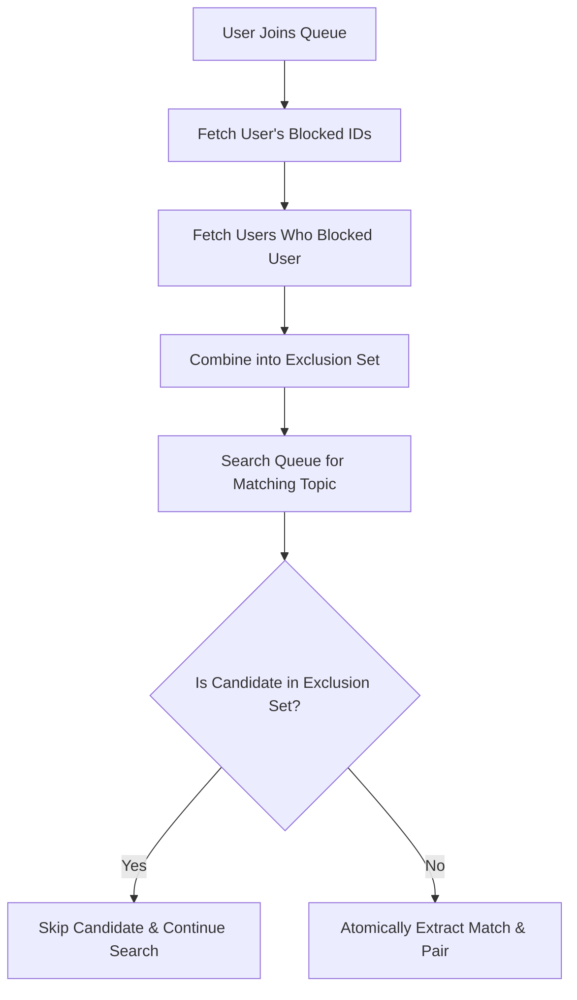

# Moderation, Safety & Trust in Real-Time Social Chat

## 1. Overview & Trust Model

In any open, random, or discovery-driven social messaging platform, user safety and harassment prevention are mission-critical. Without proactive moderation safeguards, platforms quickly degrade into toxic environments.

NexusPulse implements a multi-tiered trust and moderation framework:
1. **Zero-Tolerance Reporting (`Report` model)**
2. **Permanent Mutual-Exclusion Blocklists (`Block` model)**
3. **Automated Session Termination & Partner Eviction**
4. **Pre-Match Compatibility Screening**

---

## 2. Database Models & Schema Design

### Report Schema
```prisma
model Report {
  id              String       @id @default(cuid())
  reporterId      String
  reportedUserId  String
  conversationId  String?
  sessionId       String?
  reason          ReportReason
  details         String?
  status          ReportStatus @default(PENDING)
  createdAt       DateTime     @default(now())
  updatedAt       DateTime     @updatedAt

  reporter        User         @relation("UserReportsSent", fields: [reporterId], references: [id], onDelete: Cascade)
  reportedUser    User         @relation("UserReportsReceived", fields: [reportedUserId], references: [id], onDelete: Cascade)

  @@index([reportedUserId])
  @@index([status])
  @@index([createdAt])
}

enum ReportReason {
  SPAM
  HARASSMENT
  INAPPROPRIATE_CONTENT
  OTHER
}

enum ReportStatus {
  PENDING
  REVIEWED
  DISMISSED
  ACTION_TAKEN
}
```

### Block Schema
```prisma
model Block {
  id            String   @id @default(cuid())
  blockerId     String
  blockedUserId String
  createdAt     DateTime @default(now())

  blocker       User     @relation("BlocksCreated", fields: [blockerId], references: [id], onDelete: Cascade)
  blockedUser   User     @relation("BlocksReceived", fields: [blockedUserId], references: [id], onDelete: Cascade)

  @@unique([blockerId, blockedUserId])
  @@index([blockerId])
  @@index([blockedUserId])
}
```

---

## 3. Real-Time Action Protocols

### 1. Peer Blocking (`moderation:block`)
When a user clicks "Block User":
- The server creates a unique relational record in the `Block` table.
- If an active `MatchSession` is ongoing, the session status is updated to `TERMINATED`.
- The partner's client receives `peer:ended` with `{ reason: 'BLOCKED' }`.
- The in-memory matcher excludes the pair from ever matching in any future queue.

### 2. Abuse Reporting (`moderation:report`)
When a user submits a report through the `ReportModal`:
- A validated `Report` record is created referencing the offending user, session, and conversation logs.
- The reporting user's socket receives confirmation `{ success: true, reportId: string }`.
- The chat session terminates immediately to protect the reporting user from further unwanted exposure.

---

## 4. Pre-Match Filtering Pipeline



This guarantees that:
- Blocking is **bidirectional in effect** (neither user can see or be matched with the other).
- Filtering happens in O(1) set lookups before session creation.
