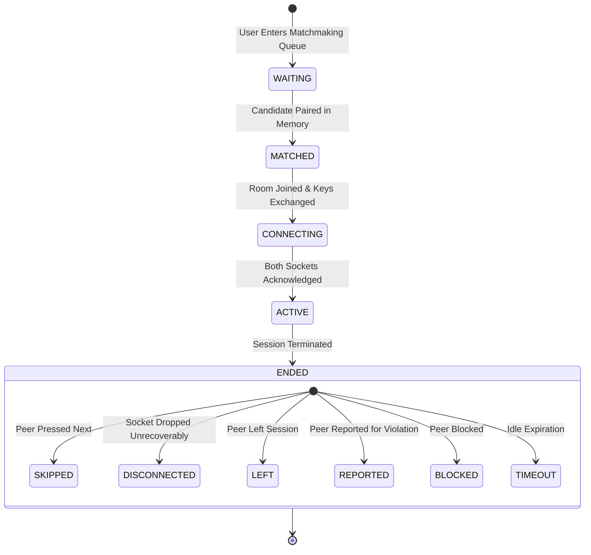

# MatchSession State Machine & Transition Rules

This document outlines the formal state machine, valid state transitions, transition authorities, idempotency guards, and terminal end reasons for a NexusPulse `MatchSession`.

---

## State Diagram

---

## 1. States & Definitions

| Status Enum | Meaning | Database Record Status | Allowed Next States |
| :--- | :--- | :--- | :--- |
| `WAITING` | User ticket is in the in-memory queue waiting for an online peer. | No DB record (transient queue) | `MATCHED`, Cancelled |
| `MATCHED` | Peer found; private conversation and session record created in ACID transaction. | `ACTIVE` (startedAt set) | `CONNECTING`, `ENDED` |
| `CONNECTING` | WebSocket rooms (`conversation:{id}`) joined; peers receiving `match:found`. | `ACTIVE` | `ACTIVE`, `ENDED` |
| `ACTIVE` | Both peers connected, exchanging messages and typing indicators in real time. | `ACTIVE` | `ENDED` |
| `ENDED` | Session closed permanently. `endedAt`, `endedById`, and `endReason` recorded. | `ENDED` | Terminal (No transitions) |

---

## 2. End Reasons (`SessionEndReason`)

When a session reaches the terminal `ENDED` state, an explicit `endReason` is assigned to capture why the interaction ended:

1. **`SKIPPED`**: One participant voluntarily requested the next peer ("Next Stranger" / `match:skip`).
2. **`DISCONNECTED`**: One participant's socket disconnected without an active reconnect within timeout.
3. **`LEFT`**: One participant explicitly closed the chat tab/room (`session:leave`).
4. **`REPORTED`**: One participant submitted a safety report against the peer (`moderation:report`).
5. **`BLOCKED`**: One participant blocked the peer (`moderation:block`).
6. **`TIMEOUT`**: Inactivity period elapsed without interaction.

---

## 3. State Transition Matrix & Authority

| Transition | Authorized Initiator | Trigger Event | Atomic Operation | Post-Action Notification |
| :--- | :--- | :--- | :--- | :--- |
| `WAITING` $\rightarrow$ `MATCHED` | Matchmaking Engine | `findAndExtractMatch` returns peer | In-memory extraction + DB transaction creating `Conversation` & `MatchSession` | Emits `match:found` to both user rooms |
| `MATCHED` $\rightarrow$ `ACTIVE` | Gateway Connection | Socket room join confirmed | Socket.io joins `conversation:{id}` room | Ready to exchange messages |
| `ACTIVE` $\rightarrow$ `ENDED` (Skip) | Either Participant | `match:skip` WebSocket event | `endSession(sessionId, userId, SKIPPED)` (Idempotent guard) | Emits `peer:skipped` to partner |
| `ACTIVE` $\rightarrow$ `ENDED` (Disconnect) | System Gateway | `handleDisconnect` of participant socket | `endSession(sessionId, userId, DISCONNECTED)` | Emits `peer:disconnected` to partner |
| `ACTIVE` $\rightarrow$ `ENDED` (Leave) | Either Participant | `session:leave` event | `endSession(sessionId, userId, LEFT)` | Emits `peer:left` to partner |
| `ACTIVE` $\rightarrow$ `ENDED` (Moderation) | Either Participant | `moderation:report` or `moderation:block` | DB block record upsert + `endSession` | Emits `peer:ended` with reason to target |

---

## 4. Race Condition & Invariant Guarantees

### Concurrent Skip Race
* **Scenario:** Alice and Bob both click "Skip" at the exact same millisecond.
* **Resolution:** 
  The first database update commits with `endedById = Alice` and `endReason = SKIPPED`.
  When Bob's request executes, `MatchSessionRepository.endSession` detects `status === MatchStatus.ENDED`, immediately returns the existing record cleanly, and avoids duplicate database errors or conflicting overwrites.

### Disconnect During Active Session
* **Scenario:** Alice loses network connectivity while chatting with Bob.
* **Resolution:**
  1. `handleDisconnect` catches Alice's socket drop.
  2. If Alice has no remaining active sockets, `MatchService.handleUserDisconnect` terminates the active session with `reason: DISCONNECTED`.
  3. Bob receives `peer:disconnected` with actionable UI prompts ("Next Stranger" or "Return to Radar").
  4. Alice's queue tickets are purged; neither user is left in a zombie waiting state.
